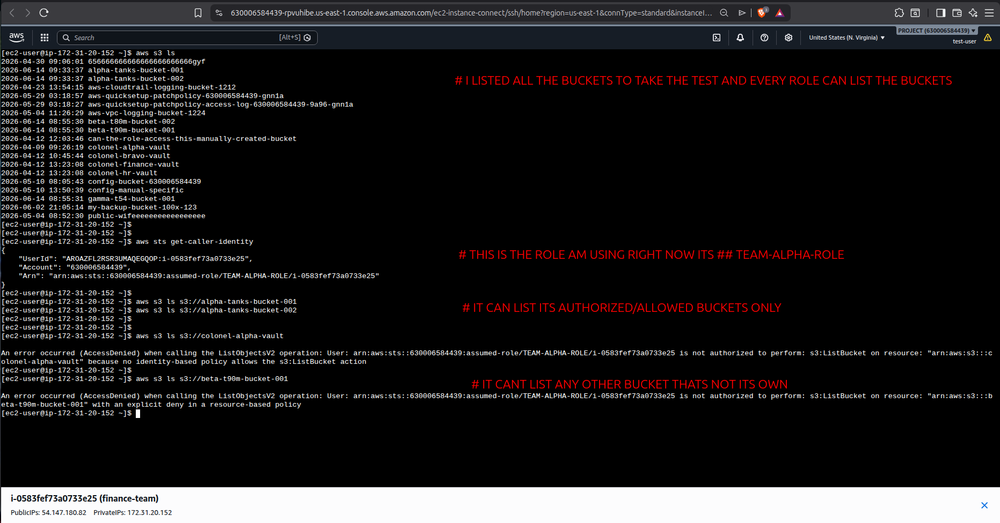

# AWS-Zero-Trust-S3-Fortress-Terraform

# ABAC Fortress: AWS Multi-Tenant S3 Isolation

This project implements an **Attribute-Based Access Control (ABAC)** architecture in AWS using Terraform. It allows multiple isolated projects to exist within a single AWS account, ensuring that roles can only access data belonging to their specific project.

## Architecture
* **Global Discovery:** A common policy allows roles to list all buckets in the account.
* **Fortress Isolation:** Every bucket and role is tagged with a `Project` attribute.
* **Deny Logic:** S3 Bucket Policies explicitly deny access to any role that does not match the bucket's project attribute.
* **ARN Locking:** Bucket policies use `aws:PrincipalArn` to ensure only specific authorized roles can pass the perimeter.

## Validation
The following screenshots demonstrate successful access to authorized buckets and the enforcement of the "Deny" policy for unauthorized projects.

## Deployment
1. Ensure your Terraform provider is configured.
2. Initialize and apply: `terraform init && terraform apply`.
3. Verify access from an EC2 instance associated with the specific project role.
